# [gravinet]

*Created by micush.*

gravinet joins your computers, servers and sites into one private, encrypted network. Install it on each machine, give them a shared key, and they find each other and connect directly: no central VPN server to run, no single point of failure. It is one small program with nothing to install beside it, and it runs on Linux, Windows, macOS, FreeBSD and OpenBSD.

You manage it from a web page, a terminal screen or a command line. All three change the same configuration.

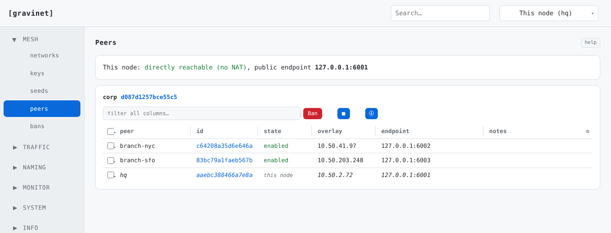

## What you get

- **A mesh, not a hub.** Every node can talk straight to every other node. If two nodes can't reach each other directly, a third node relays the traffic, and the relay only ever sees scrambled data.
- **Nodes find each other.** Point a new node at one existing node and it learns about all the rest by itself. Each node picks its own address inside your private subnet.
- **Strong encryption.** AES-256-GCM, with keys exchanged using X25519. Every network has its own keys, and you can rotate them without downtime.
- **Traffic control built in.** A firewall, NAT, priority queues (QoS) and bandwidth limits, set per network, all changeable while it runs.
- **Routes and names.** Share a subnet or a default route across the mesh, give machines names, and forward chosen DNS domains to your own DNS servers.
- **Safe upgrades.** A node builds the new version itself, tests it, and puts the old one back if the new one can't rejoin the mesh. A manager can upgrade a whole fleet from one page.
- **Plain system accounts.** Log in to the web page with the same account you use to log in to the machine.

See `docs/ARCHITECTURE.md` for the full design and `features.md` for the longer feature list.

## Contents

- [Install](#install)
- [Your first network](#your-first-network)
- [A tour of the web admin](#a-tour-of-the-web-admin)
- [The terminal screen (TUI)](#tui)
- [The command line](#the-command-line)
- [Good to know](#good-to-know)
- [How it works](#how-it-works)
- [Build from source](#build-from-source)
- [Test](#test)
- [License](#license)

---

## Install

**One line, from GitHub** (Linux, macOS, FreeBSD, OpenBSD). `get.sh` downloads the newest release of `micush/gravinet` (the newest published release, otherwise the highest `v<number>` tag), unpacks it and runs the installer for your system. Run it again to upgrade in place.

```sh
curl -fsSL https://raw.githubusercontent.com/micush/gravinet/HEAD/get.sh | sudo bash
# pass installer options after "--", or pick a tag with --version:
curl -fsSL https://raw.githubusercontent.com/micush/gravinet/HEAD/get.sh | sudo bash -s -- --version v1020
```

**From an unpacked release**, run the installer for your system. It puts the program in place, writes a starting config, registers the service and **starts it**. Running it again upgrades in place: it stops the daemon, replaces the program and starts it again.

```sh
# Linux (systemd)
sudo ./install-linux.sh

# macOS (launchd)
sudo ./install-macos.sh

# FreeBSD (rc.d)
sudo ./install-freebsd.sh

# OpenBSD (rc.d via rcctl)
doas ./install-openbsd.sh
```

On Windows, double-click `install-windows.bat`. It asks for administrator rights itself, so there is no PowerShell prompt to open and no execution policy to change. From a prompt you can also run `.\install-windows.bat -NoStart -NoNpcap`, or call `.\install-windows.ps1` from an elevated PowerShell.

If the release has no ready-made program for your system, the installer **builds it from source**. It installs a Go toolchain first if the machine has none. On Windows it also downloads the signed Wintun driver to sit beside the program, and adds a Windows Defender Firewall rule for gravinet. A Windows service has no desktop to show the "allow this app" prompt on, so without that rule peers could not reach the node even though everything looks healthy.

Useful installer options: `--no-start` (`-NoStart` on PowerShell) installs without starting, and `--uninstall` (`-Uninstall`) removes gravinet. On OpenBSD, `--no-unbound` skips the unbound setup that DNS forwarding needs.

**Uninstalling.** Each system has its own uninstaller. It stops the service and removes the program, the PAM file (and the Wintun DLL on Windows). Your config stays unless you ask for it to go.

```sh
sudo ./uninstall-linux.sh            # or uninstall-macos.sh, uninstall-freebsd.sh, or (doas) uninstall-openbsd.sh
sudo ./uninstall-linux.sh --purge    # also delete /etc/gravinet (FreeBSD: /usr/local/etc/gravinet)
```

```
.\uninstall-windows.bat              # double-click, or run from any (non-admin) prompt
.\uninstall-windows.bat -Purge       # also deletes %ProgramData%\gravinet
```

The raw service definitions are shipped as well: `gravinet.service`, `com.gravinet.daemon.plist` and `windows-service.txt`. The config the installer writes is already runnable, so the service starts straight away.

**Containers.** gravinet works inside a Linux container (LXC and similar) if the container is given what any TUN-based tool needs: the `CAP_NET_ADMIN` capability and access to `/dev/net/tun`. A privileged container already has the capability. An unprivileged one needs `CAP_NET_ADMIN` added, and `CAP_NET_RAW` too if you want the web admin's packet capture. `install-linux.sh` creates `/dev/net/tun` when it is missing (common on minimal templates). That is not enough by itself: the device must also be allowed from outside the container, for LXC with `lxc.cgroup2.devices.allow: c 10:200 rwm`, which nothing inside the container can grant itself.

**Cutting a release yourself** (all platform binaries in one version-stamped batch in `dist/`): `VERSION=1.2.3 ./scripts/release.sh`.

---

## Your first network

The quickest way is two commands.

On the **first node**, create the network. This writes the config, makes the network and its key, and prints a **join token**:

```sh
gravinet quickstart corp
```

On **every other node**, paste the token:

```sh
gravinet quickstart join <token-from-above>
```

Both commands also install the system service (unless you pass `-no-service`), and print the one follow-up command that starts it: `systemctl enable --now gravinet`, or the launchd, Windows service or rc.d equivalent. To make the token carry the first node's public address, add `addr HOST:PORT` when you create it. You can also give `subnet CIDR` and `subnet6 CIDR` here, the same as `network add` below.

**The token contains the network key. Share it over a secure channel.** It does not expire unless you ask: `gravinet network token corp expires 24h` makes a time-boxed one.

The same thing, one step at a time:

```sh
gravinet run -config ./config.json -init   # write a starting config (no networks yet)
gravinet network add corp                  # create your first network (random id and key)
gravinet run -config ./config.json         # run the daemon
```

`-init` is optional. If the config file doesn't exist, `gravinet run` writes a default one (fresh node id, no networks) and starts anyway, so a brand-new host comes up cleanly with nothing set up. There is **no default network**. A network exists only because you created it.

Then open the web admin. It is **on by default** at `https://127.0.0.1:8443` with a self-signed certificate, so your browser will warn you once. Sign in with the account you use on the machine.

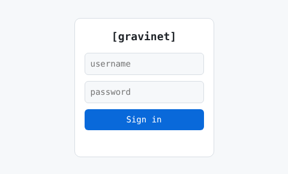

---

## A tour of the web admin

The left side has groups of pages: **Mesh**, **Traffic**, **Naming**, **Monitor**, **System** and **Info**, with **Settings** and **Sign out** pinned at the bottom. A **search box** at the top searches every page (routes, hosts, rules, keys, seeds, peers, bans, settings, across every network) and clicking a result jumps straight to it. The picker beside it chooses which node you are looking at when you manage a fleet. There is a light and a dark theme.

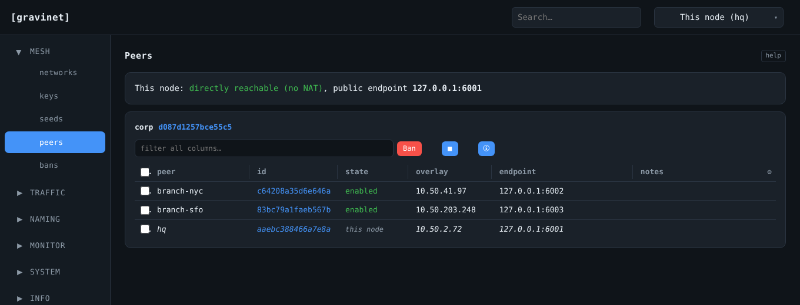

**Every page is editable.** Anything you can do from the command line you can do here. Firewall, NAT, QoS, bandwidth and manager-mode changes apply live. Structural changes (networks, routes, addressing) are saved at once and show a **Restart now** button to bring them into effect. In every table you can tick rows and use the buttons above the table, and anything about one row is a double-click on the cell itself. A network's, NAT rule's or bandwidth cap's on/off tag is switched by double-clicking it. Each page has a **help** button.

### Mesh

**Networks** lists every network this node belongs to, with its subnets, this node's address and how many peers and seeds it has. A host can be in as many networks as you like. Each one is independent, with its own key, interface and subnet.

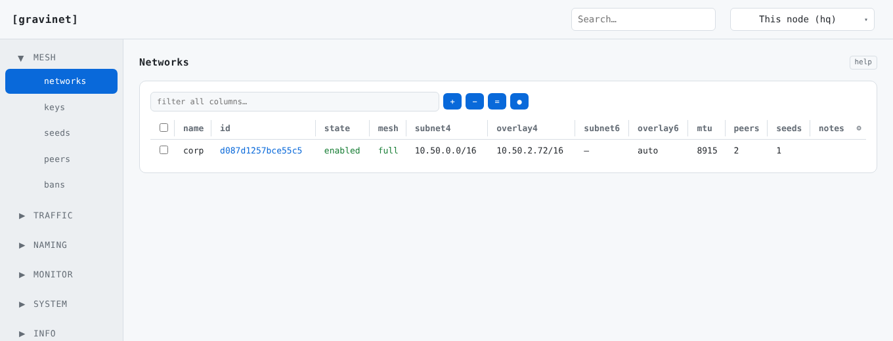

**Keys.** Each network has **8 key slots**. Every enabled key lets a node join, which is what makes rotation seamless: generate a new key, hand it out, run both while nodes move over, then disable and delete the old one. gravinet refuses to disable or delete the last enabled key, because that would lock the network. Key changes take effect on restart.

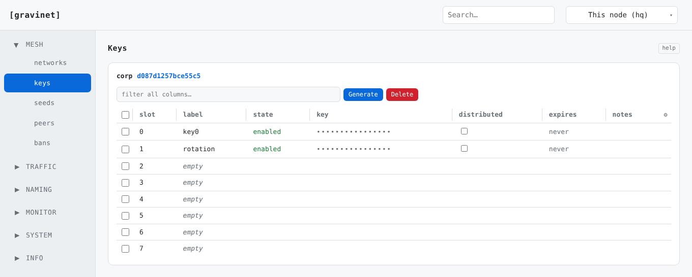

**Seeds** are the addresses a node tries first to find the mesh. A seed can be given without a port. gravinet then tries your first UDP port (65432 by default), then the well-known ones (443, 4500, 3478, 1194, 500, 53), so a port-less seed is tried on all of them. Give an explicit `host:port` only to pin a seed to one port.

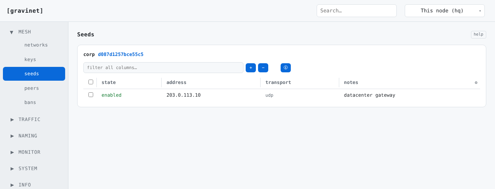

**Peers** shows every node on the network, and whether this node is reachable directly or through NAT. Tick peers and press **Ban** to block them.

**Bans** are blocks on nodes that tried to join or reconnect. A ban spreads to the whole mesh, remembers which node set it, and expires on its own unless that node keeps refreshing it. Several admins can ban the same node. If the node that set a ban is gone for good, a force-unban clears it.

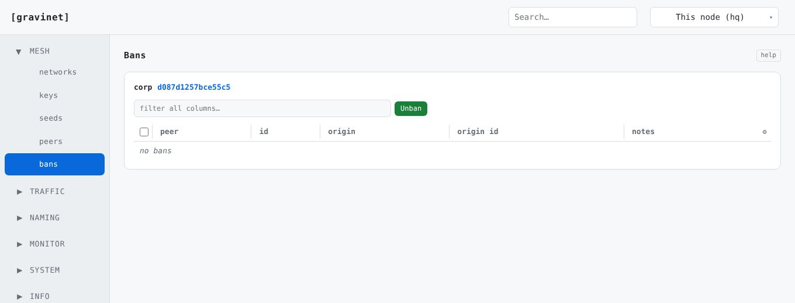

### Traffic

**Firewall.** An ordered list of rules for each network, with everything allowed unless a rule says otherwise. Rules match on direction, protocol, address and port, and can be reordered, copied and pasted. It is **stateful**: rules describe new connections, and replies to connections you started come back by themselves, so a single `deny in` blocks only unsolicited inbound traffic. Direction is relative to the tunnel, so traffic this node forwards between the mesh and another interface is covered by the same rules.

A separate **Allow List** tab holds the node-wide exceptions (management, BGP, OSPF and RIP by default). They sit outside every network's rules, so a broad `deny` can never lock you out of management or routing.

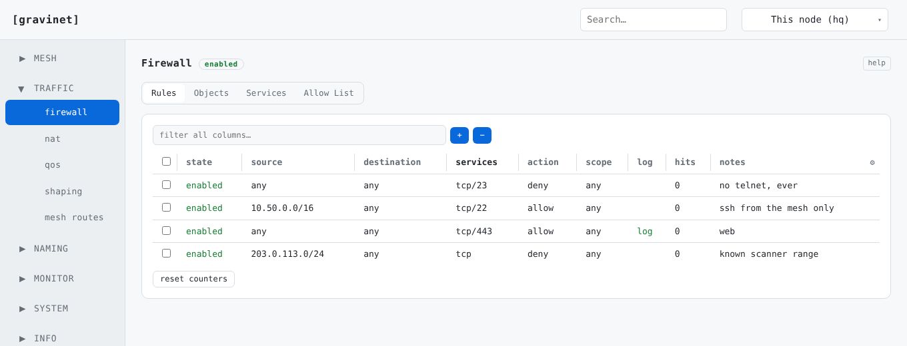

**NAT.** Source NAT (masquerade, with port translation) and destination NAT (port forwarding), with connection tracking so replies are translated back. A rule belongs to one address family. The kernel path (nft, iptables or pf) handles traffic leaving a physical interface, for IPv4 and IPv6. The overlay path translates between overlay peers and is IPv4 only.

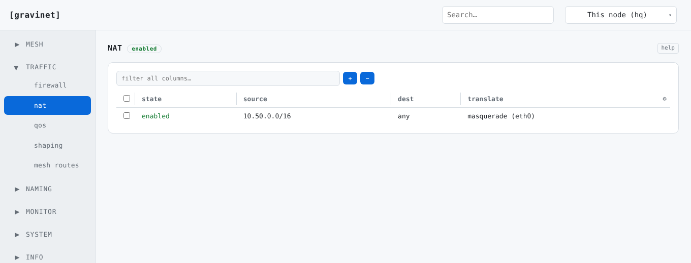

**QoS.** Outgoing traffic is sorted into priority classes by protocol, port or DSCP, and sent strictly in priority order when the link is busy, so what matters goes first.

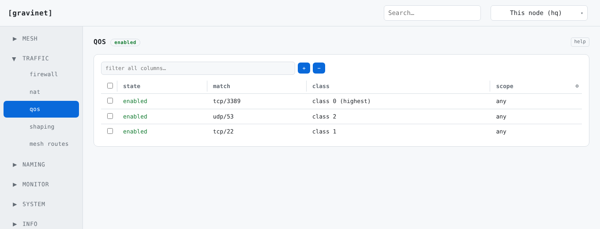

**Shaping** caps bandwidth per interface, in either direction, on any interface and not just the overlay. Outgoing traffic is queued and paced to the rate, and incoming traffic over the limit is dropped. Mesh interfaces are paced inside gravinet, in line with the QoS classes and leaving control traffic alone. Other interfaces are shaped through the kernel's queueing (`tc` on Linux).

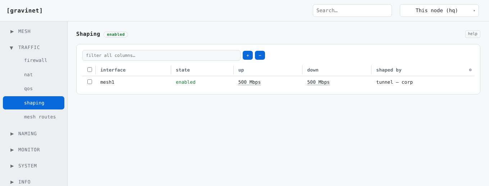

**Mesh routes** shares routes across the mesh: a subnet you can reach, or a default route. Peers choose the best match, and you can reject routes you don't want from a peer or prefer one peer's copy of a route over another.

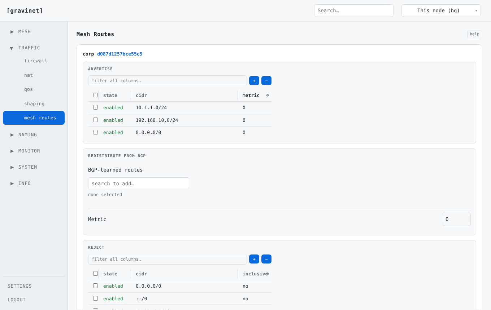

On hosts with FRR installed there are also **BGP/BFD** pages, which hold the config gravinet gives to FRR, and **IPv6 router advertisements**.

### Naming

**DNS** forwards chosen domains to DNS servers inside the mesh. Say that `corp.internal` is answered by `10.50.2.53` and every node sends those lookups there. On Linux this uses systemd-resolved, and on OpenBSD it needs unbound as the system resolver.

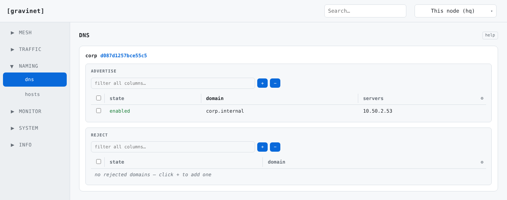

**Hosts** are names you give to addresses. They are advertised to every peer and written into each node's hosts file. You can refuse a name a peer advertises.

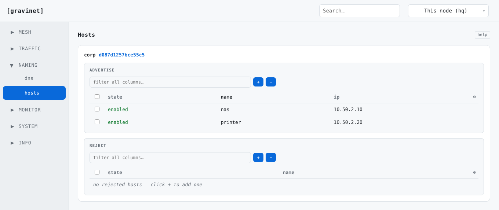

### Monitor

**Metrics** draws live CPU, memory, disk and traffic for each overlay interface, over the last minute up to 24 hours.

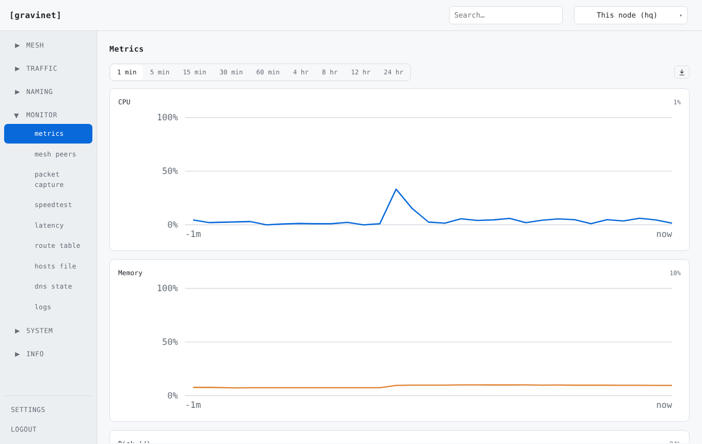

**Mesh peers** shows the health of every connection: the transport in use, whether it is direct or relayed, round-trip time, how long it has been up and its traffic counters.

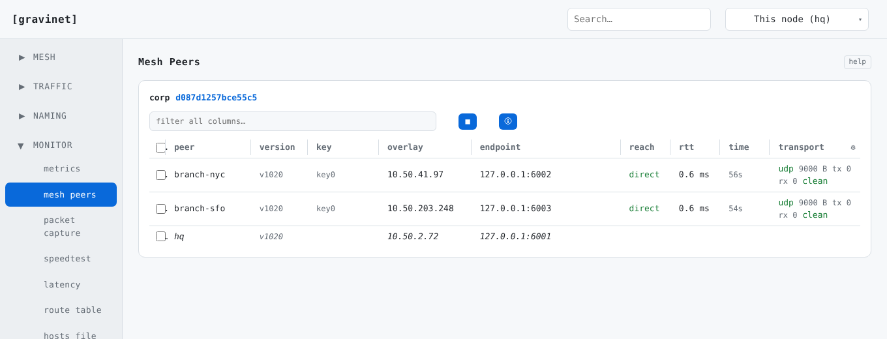

**Latency** measures the round trip from this node to every other peer.

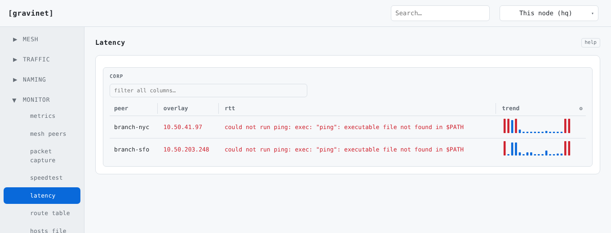

**Logs** shows the daemon's recent log output.

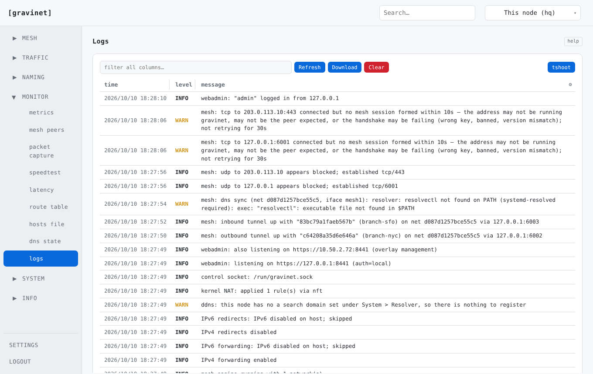

Also under Monitor: a live **packet capture** on an overlay interface, a **speedtest** between this node and a managed peer, the live kernel **route table**, live **BGP sessions** and **LLDP/CDP neighbours** when those are available, the **hosts file**, and the **DNS state** the operating system has registered.

### System and upgrades

**Upgrade** builds a new version of gravinet on the node and swaps it in. Pick a source archive (`.tgz`, `.tar.gz` or `.zip`) and press **Upgrade**. Or tick **Fetch from online** and press **Upgrade** with no file at all: the node then downloads the newest release of `micush/gravinet` from GitHub itself (the newest published release, otherwise the highest `v<number>` tag) and carries on exactly as with an uploaded archive. The node needs to reach `api.github.com` and `github.com`.

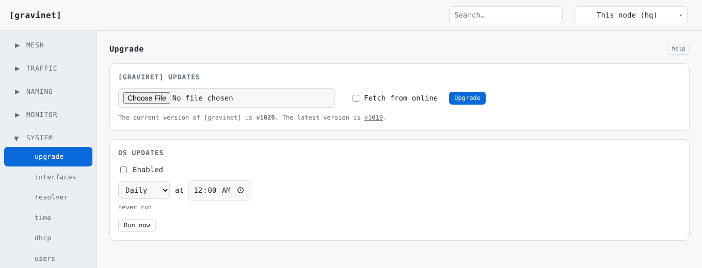

Whichever way the archive arrives, the node builds it with its own Go toolchain, runs a self-test against its own config, and installs it behind a **confirm-or-rollback guard**. If the new version can't get its peers back within the confirm window, it puts the old one back by itself. A node that has a **Manager** can upgrade other nodes as well. Pick specific peers, or "all peers, then this node", to roll the whole fleet with this node last. The archive is downloaded once and pushed to every peer, a seed is always held back until last and done one at a time, and each peer must have **Accept Manager-pushed upgrades** turned on. A peer that can't rejoin reverts on its own.

Other System pages: network **interfaces**, **resolver**, **time** (clock, timezone and NTP), **DHCP**, **users** (console accounts), **config history**, and **power** (restart or shut down the host). When the host supports them there are also SNMP, LLDP/CDP and syslog forwarding.

### Settings and Info

**Settings** holds the node-wide choices: manager and managed mode, ports, login lockout, logging, keepalive and timeout timers, IP forwarding, UPnP, GeoIP, the TLS certificate, and performance tuning such as worker threads and UDP GSO.

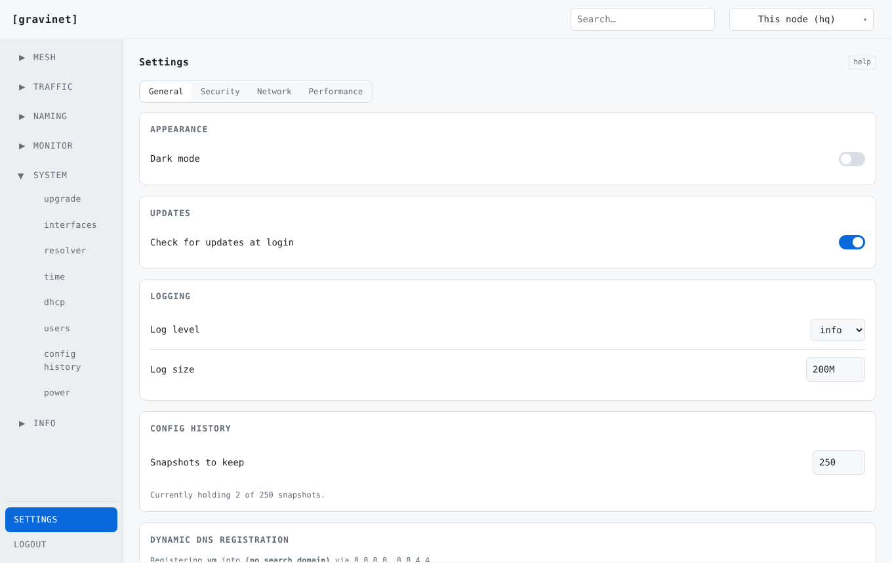

**Info** has this README, a getting-started walkthrough (installing, then almost everything else from the web page), the API reference, the license and build and host details.

### Logging in and exposing the admin

On a headless or remote host the admin listens on localhost only, so tunnel in:

```sh
ssh -L 8443:127.0.0.1:8443 user@your-server
# then open https://localhost:8443
```

To limit which system users may log in, list them under `web_admin.allow_users` (empty means any account the system accepts). To expose the admin on the network instead of tunnelling, set `web_admin.listen` to `0.0.0.0:8443`, then firewall it and supply a real certificate in `tls_cert` and `tls_key`. Three failed logins in a minute lock the address out for 15 minutes.

Logins use the system's own accounts: **PAM** on Linux, macOS and FreeBSD, `login_passwd` (BSD auth) on OpenBSD, and `LogonUser` on Windows. That needs a build with system auth, which the installers make. A plain cross-compiled `CGO_ENABLED=0` Linux or macOS binary has no PAM, so the admin falls back to local users. Create one with `gravinet genpass`, set `auth_mode` to `local`, and add it to `web_admin.users`.

**Can't log in?** Check the daemon's startup log. The line `webadmin: listening … (auth=pam)` means PAM is active. `(auth=local)` means PAM wasn't compiled into this binary, so system logins can't work, and the log says so and tells you to reinstall from source or switch to a local user. The other common cause is a missing `/etc/pam.d/gravinet` file, which the daemon warns about at startup with the exact command to create it. The installers check that the binary really links libpam and rebuild a PAM-enabled one when needed, warning loudly if they can't.

---

## TUI

`gravinet tui` is the web admin's own layout in a terminal: the same sidebar (Mesh, Traffic, Naming, Monitor, System, Info, with Settings at the bottom), reading the same config file and control socket the command line does. It is for the times the machine has no browser you can reach.

```sh
gravinet tui
```

No flags are needed. It finds the same config `gravinet run` would (`$GRAVINET_CONFIG`, then the platform default). Over ssh: `ssh user@your-server -t gravinet tui`.

**Mesh, Traffic, Naming, System and Settings can all be edited here**, in one of two ways. Lists (networks, firewall rules, BGP neighbours, users) use `a` to add, `e` to edit, `d` to delete (with a confirmation) and `space` to toggle, as the footer shows for the row you are on. Named settings (Settings itself, a hostname, an enabled flag) have a one-key shortcut: every editable field has one underlined letter, and pressing it from anywhere on the page opens that field. Every edit runs the same `gravinet` command you would type, or calls the same validated setter the web admin uses. Monitor and Info are read-only, and a few single fields are too, each for a reason shown on the page.

Other keys: `/` searches every page, `n` and `N` jump between hits, `r` re-reads everything, `t` switches light and dark, and `?` lists every key. `space` on a rail row previews the page without leaving the rail, and `enter` commits and moves focus onto it.

---

## The command line

Everything is driven by one JSON config file. You can edit it by hand, but the commands below are structured and checked. They edit the file and ask a running daemon to reload, so **every change is saved** and survives a restart.

Most commands take an optional `-net NAME` (only needed when you run more than one network) and `-config PATH` (default `/etc/gravinet/config.json`). `-net` takes a network **name or id**, everywhere, including the commands that talk to the running daemon (`ban`, `unban`, `fw`). Any unambiguous prefix of a command works, so `gravinet mon met` is `gravinet monitor metrics`. Run `gravinet help` for the full list, laid out like the web admin's sidebar.

**Networks**

```sh
gravinet network add corp                          # new network (random id + key)
gravinet network join e4ba5a47668a1465 key <KEY> peer 198.51.100.7   # join an existing mesh by its id
                                                   # (the id comes from 'network list' on a node already in it;
                                                   #  the name and subnet are learned from the seed. No port
                                                   #  means it tries 65432 + the alternates; restarts the service)
gravinet network enable corp
gravinet network disable corp                      # leave but keep the config
gravinet network rename corp office                # change the label (the id stays; no restart)
gravinet network subnet corp subnet 10.80.0.0/16   # change the overlay subnet(s); 'none' clears a family
                                                   # (restart; apply on every node)
gravinet network delete corp                       # leave and remove it
gravinet network list
```

**Routes, seeds and keys**

```sh
gravinet route add 10.1.1.0/24                     # redistribute a local route
gravinet route redistribute 0.0.0.0/0              # advertise a default route
gravinet route reject 10.99.0.0/16                 # refuse a peer's advertisement
gravinet route prefer 0.0.0.0/0 <nodeC> <nodeB>    # pick which peer's copy to follow
gravinet route prefer-clear 0.0.0.0/0              # back to lowest-metric wins
gravinet route delete 10.1.1.0/24
gravinet route list

gravinet seed add 198.51.100.7 -net corp -notes "office gateway"  # bootstrap address
gravinet seed remove 198.51.100.7 -net corp
gravinet seed disable 198.51.100.7 -net corp       # stop dialing it, keep the row
gravinet seed enable 198.51.100.7 -net corp
gravinet seed list -net corp

gravinet key list -net corp                        # show the 8 join-key slots
gravinet key generate -net corp -label rot2        # make a new key in a free slot
gravinet key show 1 -net corp                      # reveal a key to hand to joiners
gravinet key set 2 <KEY> -net corp                 # import an existing key
gravinet key disable 0 -net corp                   # retire an old key (rotation)
gravinet key delete 0 -net corp
```

**NAT, QoS and bandwidth**

```sh
gravinet nat add eth0                              # masquerade the overlay out eth0
gravinet nat enable
gravinet nat list

gravinet qos add tcp 3389 priority highest         # prioritise RDP
gravinet qos add udp 53 priority normal
gravinet qos list

gravinet bandwidth add -iface mesh0                # start shaping an interface
gravinet bandwidth up 150mbps -iface mesh0         # cap its egress
gravinet bandwidth both 1gbps -iface mesh0
gravinet bandwidth both 0 -iface mesh0             # unlimited (removes the cap)
gravinet bandwidth disable -iface mesh0            # lift the cap but keep the rate
gravinet bandwidth enable -iface mesh0             # reapply the kept rate
gravinet bandwidth del -iface mesh0                # stop shaping it entirely
gravinet bandwidth list
```

**Names, firewall, management and bans**

```sh
gravinet host add nas 10.0.0.5 -net corp           # advertise a hostname record
gravinet host reject printer -net corp             # refuse a peer's advertised host
gravinet host list -net corp

gravinet fw add -action deny -proto tcp -dport 23  # firewall (live + saved)
gravinet fw exempt list                            # the node-wide allow list (management, BGP, OSPF, RIP
                                                   # by default; never subject to any network's rules)
gravinet fw exempt add ospf -proto tcp -port 179
gravinet fw exempt reset

gravinet managed on                                # accept management from Manager-mode peers
gravinet manager on                                # let this node manage other Managed peers

gravinet ban add <node>                            # distributed ban (runtime)

gravinet list        # print the whole config
gravinet status      # live peers, bans and routes from the running daemon
```

Per-network DNS forwarding has no command of its own yet. Set it up in the web UI's **DNS** page, or edit `dns_advertise` and `dns_reject` in the JSON config.

**Other commands.** `gravinet run` starts the daemon, `genkey` makes a key, `genpass` makes a local web-admin user, and `service <print|install|uninstall>` manages the system service (a `Type=notify` systemd unit, a launchd plist, or `sc.exe` commands, with the Windows service dispatcher built in).

---

## Good to know

**Choosing your own subnets.** Pin the overlay range when you create or join a network, with `subnet` (IPv4) and `subnet6` (IPv6), as a bare keyword or a `-flag`:

```sh
gravinet network add corp subnet 10.50.0.0/16 subnet6 fd00:abcd::/48   # dual-stack
gravinet network add v4net subnet 172.16.0.0/12                        # IPv4 only
gravinet network add v6net subnet6 fd00:6::/64                         # IPv6 only
gravinet network add lab -subnet 10.80.0.0/16 --subnet6=fd00:80::/64   # flag form
```

Give both for dual-stack, or one for a single family. Give neither and you get a dual-stack pair assigned for you (`10.42.0.0/16`, `10.43.0.0/16`, … with matching `fd00:N::/64`) that never overlaps another network on the host.

**Several networks on one host.** Each is a separate overlay, all carried over the one UDP port. Everything per-network belongs to one network only: bans, routes, firewall, NAT, QoS and bandwidth. On the command line you pick the network with `-net NAME`, which is required once you have more than one. In the web admin every page shows one card per network. A network's **id is permanent** (it is what peers recognise it by), but its **name and subnets can be changed**: `network rename` changes the label live, and `network subnet` changes the range (restart needed, and make the same change on every node in that network).

**What applies live and what needs a restart.** Firewall rules, NAT, QoS, bandwidth caps and managed or manager mode all apply to the running daemon at once, including turning any of them on or off, and are saved to the config, so they survive a restart. Structural changes (adding, removing, enabling, disabling or joining a network) need interfaces and sessions rebuilt, so the `network` commands **restart the service for you** (via systemd, launchd or the Windows service manager). Pass `--no-restart` to skip that. The CLI tells you which case you are in after each change.

**Key rotation.** `key generate` a new key, hand it out (`key show` reveals it), let both run while nodes move over, then `key disable` and `key delete` the old one. In the web admin the Peers, Keys and Bans tables are multi-select, so one button acts on a whole selection.

---

## How it works

For the curious, this is what is under the hood. The full design is in `docs/ARCHITECTURE.md`.

- **Config, crypto, protocol, TUN and transport.** Hot-reloadable config. AES-256-GCM, X25519 and HKDF, keys matched by identity, replay protection. A Linux TUN driven by raw ioctls (jumbo MTU, IPv4 and IPv6, poller-managed I/O). A UDP underlay with alternate ports and a cores-minus-one `SO_REUSEPORT` worker pool. A node listens on a set of UDP ports and a set of TCP/TLS ports (`udp_ports` and `tcp_ports`, or Settings ▸ Underlay), with no primary and no fallback, so a peer behind a restrictive firewall can use whichever well-known port gets through. Each port is best-effort and applied live. The extra ports are advertised to peers (in the handshake and in gossip) so the mesh really tries them: TCP dials every advertised candidate for a peer in parallel, and extra UDP ports join the pool of seed addresses used for ordinary bootstrap.
- **Handshake and sessions.** PSK-authenticated X25519, O(1) index demultiplexing, roaming across NAT, key-slot cycling and brute-force banning.
- **Mesh formation.** Peer lists spread by gossip, so the full mesh forms from a single seed, with ping and pong keepalives, pruning of dead peers and a cooldown on unreachable seeds.
- **Addressing.** The subnet is announced in the handshake. A node picks a random address and checks for duplicates before claiming and announcing it.
- **Control plane.** `ban`, `unban` and `list` go over a control socket. Bans flood across the mesh with their origin recorded, are lifted only by the origin, carry a time to live and are refreshed by a live origin, so a departed origin's bans heal themselves. Hostnames sync into the OS hosts file. Routes redistribute with longest-prefix matching and reject rules.
- **Relaying.** When two nodes can't connect directly, traffic goes through a willing third node, end-to-end encrypted, so the relay sees only ciphertext.
- **Broadcast and multicast.** Frames flood to the mesh, rate-limited by a token bucket for each class (storm control).
- **IP forwarding.** IPv4 and IPv6 forwarding is switched on at startup by default (`ip_forwarding: false` opts out), which is what lets redistributed routes and NAT carry traffic to other interfaces. It is best-effort per family and restored to its old value on a clean shutdown.
- **Web admin.** An HTTPS UI and JSON API over the running engine, with session login and a 3-fails-per-minute, 15-minute lockout. See `docs/API.md` for the API.
- **Runs as a service.** `gravinet service` writes a `Type=notify` systemd unit (with sd_notify), a launchd plist or `sc.exe` commands, and it runs under the Windows service manager. macOS uses `utun` and Windows uses Wintun, with the signed driver DLL built into the binary.

It is tested across the tree and under `-race`, including a relay through a blocked underlay, broadcast delivery and storm limiting over real UDP, the ban life cycle (plus a live three-daemon force-unban), bandwidth shaping, QoS scheduling, the firewall (full life cycle, a data-path drop and automatic return traffic), NAT (a live masquerade round trip), the web admin (a live HTTPS login and authenticated API), the service layer (sd_notify, unit generation, a graceful SIGTERM), and a hardening pass: fuzzing of every wire decoder and the packet entry point with no panics over hundreds of thousands of runs, AEAD tamper and replay rejection, and the brute-force join throttle.

---

## Build from source

```sh
# Default build: cgo on, so the web admin's PAM login works (Linux and macOS)
CGO_ENABLED=1 go build -o gravinet ./cmd/gravinet
```

On Linux this needs the PAM headers (`libpam0g-dev` on Debian and Ubuntu, `pam-devel` on RHEL and SUSE) and a C compiler. macOS has them in the SDK. **Build with `CGO_ENABLED=1`** unless you have a reason not to: a `CGO_ENABLED=0` binary is fully working but has no PAM, so the web admin uses local users (`gravinet genpass`) instead of your system login. Windows web-admin login uses `LogonUser` and needs no cgo. OpenBSD signs in system accounts through `login_passwd(8)` without cgo, so its static build keeps system login.

To cross-compile (cgo can't cross-link libpam, so these are the no-PAM, local-login builds):

```sh
CGO_ENABLED=0 GOOS=windows GOARCH=amd64 go build -o gravinet.exe ./cmd/gravinet
CGO_ENABLED=0 GOOS=darwin  GOARCH=arm64 go build -o gravinet      ./cmd/gravinet
```

**Release builds for every target, with dependencies bundled:**

```sh
./scripts/build-all.sh           # fetch and verify Wintun, vet, test, build every target
VERSION=1.0.0 ./scripts/build-all.sh
```

One command makes a self-contained binary for Linux (amd64, arm64, arm), Windows (amd64, arm64), macOS (amd64, arm64), FreeBSD (amd64) and OpenBSD (amd64, arm64), plus `SHA256SUMS`. The binary for the **host** platform is built with cgo (PAM on, tagged `(PAM)`). The cross-compiled ones are static and use local web logins. OpenBSD is the exception among them: it has no PAM, but its admin still signs in system accounts through `login_passwd(8)`, so it needs no separate build.

The script downloads and checksum-verifies the signed Wintun driver and builds it into the Windows binaries. That is the only non-Go runtime dependency. Use a prefetched copy with `WINTUN_DIR=/path/to/wintun/bin`, insist on it with `REQUIRE_WINTUN=1`, or skip it to build with a side-by-side `wintun.dll`. The Windows kernel driver still installs at run time, because Windows requires that.

---

## Test

```sh
go test ./...
go vet ./...
```

## Status

All 15 roadmap steps are complete. `docs/ARCHITECTURE.md` has the full design and an honest list of the platform-bound parts (PAM and Windows login, the macOS and Windows TUN drivers, the Windows service dispatcher), which are written and cross-compile but can only be exercised on their own operating systems.

## License

[gravinet] is free software, licensed under the **GNU General Public License, version 3** (GPLv3). See the `LICENSE` file for the full text.

The core is pure Go with no third-party module dependencies. On Windows the signed Wintun driver DLL is built into the binary. The prebuilt Wintun binaries are distributed by their authors under a permissive license (not the GPLv2 that covers the Wintun source), so including them is compatible with GPLv3. That license and its attribution are kept in `third_party/wintun/`, and the installers and release bundles ship it alongside the driver. The Wintun kernel driver is loaded at run time as a separate component.
